# Public Equity Investing：设计框架与全工作流图解

这份导学面向 UniPat.ai 的 AI 金融投研应用工作：先理解它如何把一个投资问题拆成可追溯的研究过程，再看各个工作流如何分工、接续、降级和交付。阅读对象是当前本地 `PEI_OPENAI ` 目录，检查日期为 2026-09-14；目录名末尾含一个空格。

**核心判断：这是一个以投研工作流为单位组织的 Agent 插件源码包。** 它通过 Markdown 规则约束研究判断，通过 Python 辅助脚本处理确定性计算和文件生成，通过来源、模型审计与报告质检约束交付质量。下面的“设计动机”是基于这些机制的分析；图中业务箭头表达规定或建议的衔接，只有明确标为“代码调用”的图才表达已核对的函数调用关系。

本次覆盖路由表中的 **21 个投研工作流**、总路由、显式用户设置入口，以及内部注册表中的 **7 个支持模块**。已静态阅读入口规则、工作流定义、主要共享契约和代表性脚本；没有执行一轮真实公司研究、连接行情服务或运行全部测试，因此本文不把文档要求等同于真实运行成绩。当前目录不是 Git 仓库，无法标注提交号；文末附关键文件的快照校验值。本文只新增导学材料。

阅读方式：先读图 1—4 建立框架，再沿“财报前—财报后—更新模型—更新观点—风险决策”的主链阅读，最后回看支持层和工程边界。Mermaid 图保留为可编辑文本；阅读器支持 Mermaid 时显示流程图，不支持时仍可阅读节点与箭头。

**章节导航：** [总体架构](#architecture) · [入口与设置](#routing) · [21 个工作流](#workflows) · [7 个支持模块](#support) · [关键机制拆解](#mechanics) · [设计取舍](#boundaries) · [六次小课](#learning) · [源码快照](#snapshot)


## 一、先理解它到底在组织什么

### 图 1：从研究问题到投资判断

普通公司信息只是起点。这个包反复要求回答：市场已经预期了什么、我们与市场的分歧在哪里、什么证据会证明或推翻观点、估值和下行风险如何变化，以及这些变化是否足以改变行动。PM 指投资组合经理；thesis 指可被证据检验的投资观点；variant perception 指相对于市场预期的差异化判断。


为什么以“工作流”划分？因为“分析财报”“修改模型”“写投资建议”虽然都围绕一家公司，要求的输入、判断责任和可交付结果不同。把它们拆开后，可以保留相同的来源纪律，同时避免一份公司简介未经估值和风险分析就变成买入建议。依据：[README.md](</Users/marcuschen/Desktop/AI 投研/PEI_OPENAI /README.md>)、[shared/plugin-routing-map.json](</Users/marcuschen/Desktop/AI 投研/PEI_OPENAI /shared/plugin-routing-map.json>)。

### 图 2：整体分层架构

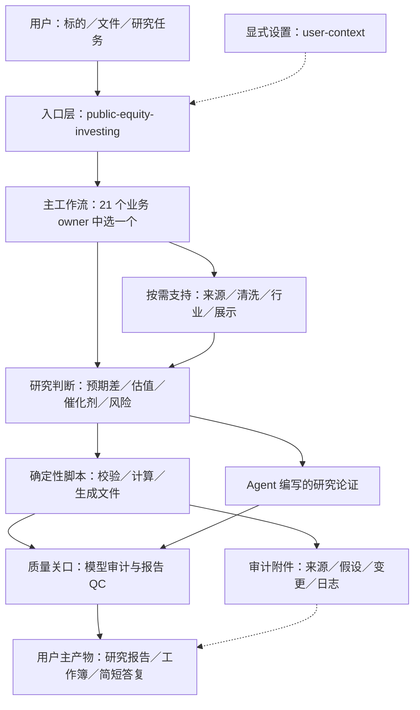

这里的 owner 是“对最终工作成果负责的工作流”，不是独立服务器或一个持续运行的进程。`SKILL.md` 是 Agent 读取的指令；`references/` 是按需要加载的方法与规范；`scripts/` 是可执行工具；`shared/` 提供共同契约和部分代码。路由表是声明式规则，不能仅凭这张图推定存在自动执行全部节点的 DAG 调度器。

### 图 3：为什么要保留主工作流的判断责任

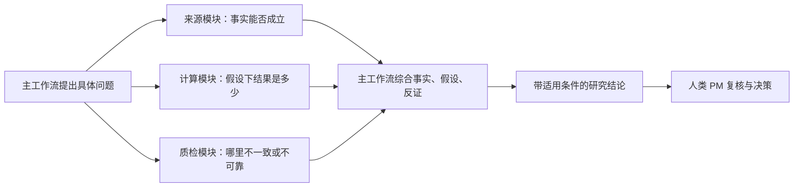

支持层交接时需要保留 `owning_workflow`、`decision_impact`、`readiness_effect`、`artifact_role` 和 `hidden_unless_requested`。这些字段让“发现了一个数字冲突”继续传导为“哪个估值结果不可信、交回谁处理”。它们并非已经在所有模块中统一落地的数据库表；契约允许保存在工作上下文、交接结构或审计附件中。依据：[shared/support-layer-routing-contract.md](</Users/marcuschen/Desktop/AI 投研/PEI_OPENAI /shared/support-layer-routing-contract.md>)。

### 图 4：一条适合首先学习的完整财报链路

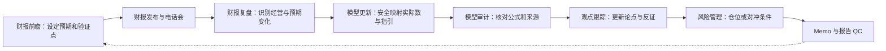

这是一条用于学习的组合路径，不是每次财报分析必须执行的流水线。例如用户只需要复盘，可以在解释模型影响后结束；只有提供模型并要求更新时，才进入工作簿修改。建议带着同一个问题读所有节点：“这一步新增了什么判断，留下了什么可供下一步复核的证据？”

<a id="routing"></a>

## 二、入口与设置：先决定谁来负责

### 图 5：总路由 public-equity-investing

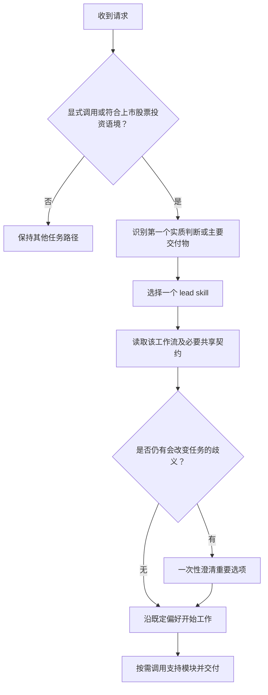

入口根据“真正要做什么”选 owner。例如已经发布财报、用户关心投资观点变化时进入 deep dive；用户明确要把新数据写入旧模型时由 model update 主导。若用户直接调用专门 skill，仍要求读取跨工作流运行契约。当前入口、README 与路由表对自动触发的措辞有宽窄差异：路由表把缺少投资决策语境的泛化提问列为不触发例子。工程上应测试真实句子是否一致路由，而不能只验证文件存在。阅读：[skills/public-equity-investing/SKILL.md](</Users/marcuschen/Desktop/AI 投研/PEI_OPENAI /skills/public-equity-investing/SKILL.md>) → [shared/invocation-policy.md](</Users/marcuschen/Desktop/AI 投研/PEI_OPENAI /shared/invocation-policy.md>) → [shared/plugin-routing-playbook.md](</Users/marcuschen/Desktop/AI 投研/PEI_OPENAI /shared/plugin-routing-playbook.md>) → [shared/plugin-routing-map.json](</Users/marcuschen/Desktop/AI 投研/PEI_OPENAI /shared/plugin-routing-map.json>)。

### 图 6：显式设置 user-context

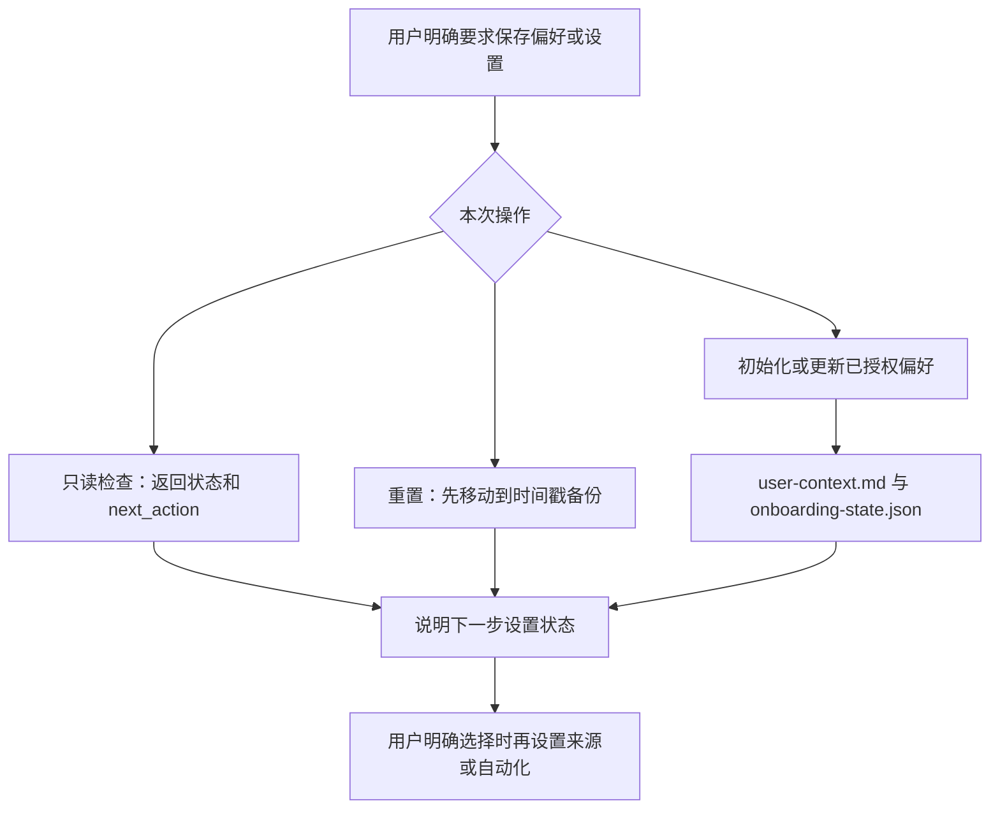

普通研究不先执行设置检查，也不自动初始化用户状态。这样一次财报提问可以直接使用用户文件，而不必先完成所有数据源连接。`user_context_preflight.py` 的 `next_action()` 解释设置步骤；它不证明任何数据源真的可读。阅读：[skills/user-context/SKILL.md](</Users/marcuschen/Desktop/AI 投研/PEI_OPENAI /skills/user-context/SKILL.md>) → [skills/user-context/scripts/user_context_preflight.py](</Users/marcuschen/Desktop/AI 投研/PEI_OPENAI /skills/user-context/scripts/user_context_preflight.py>)。本次只研究该流程，没有初始化偏好或创建自动化。

<a id="workflows"></a>

## 三、21 个投研工作流：逐个看输入、判断、输出

以下按学习依赖排序。每节的第一段给出触发场景，图给出分析主链，后两段解释设计原因和脚本边界。工作流之间可组合使用，实际调用取决于用户的任务。

| 编号 | 工作流                           | 核心问题                       |
| ---- | -------------------------------- | ------------------------------ |
| W01  | `idea-generation`                | 发现值得研究的候选             |
| W02  | `company-tearsheet`              | 建立公司事实底稿               |
| W03  | `initiating-coverage`            | 搭建首次覆盖研究               |
| W04  | `earnings-preview`               | 财报前：建立预期门槛           |
| W05  | `earnings-deep-dive`             | 财报后：判断什么真正变了       |
| W06  | `financials-normalizer`          | 把披露转成可建模数据           |
| W07  | `three-statement-model-builder`  | 构建三张报表联动的预测         |
| W08  | `dcf-model-builder`              | 把经营假设转换成内在价值       |
| W09  | `comps-valuation`                | 用可比公司解释相对估值         |
| W10  | `equity-model-update`            | 把新信息安全写入旧模型         |
| W11  | `scenario-sensitivity-generator` | 找出判断在哪些条件下改变       |
| W12  | `catalyst-calendar`              | 把未来事件转成研究准备计划     |
| W13  | `event-driven-analyzer`          | 对特定公司事件做概率与收益分析 |
| W14  | `economic-impact-report`         | 把宏观变化传导到上市公司       |
| W15  | `long-short-pitch`               | 把研究观点构造成交易提案       |
| W16  | `portfolio-risk-management`      | 决定持有多少与如何对冲         |
| W17  | `thesis-tracker`                 | 保留原观点并持续检验           |
| W18  | `meeting-prep`                   | 把研究缺口变成有效问题         |
| W19  | `memo-builder`                   | 把已完成的分析组织成决策文件   |
| W20  | `model-audit-tieout`             | 检查模型能否支撑指定判断       |
| W21  | `deck-report-qc`                 | 交付前核对报告和模型的一致性   |

### W01 · 发现值得研究的候选（idea-generation）

给一个行业、主题或候选池，挑出下一步最值得投入研究的名字。

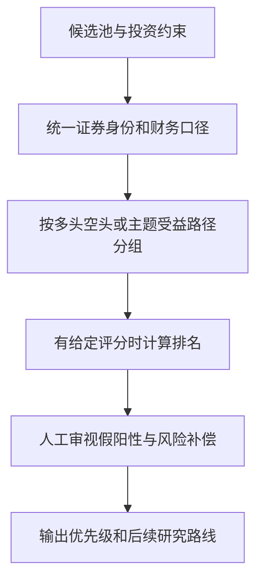

设计先筛选范围、再划分受益路径、最后排序，避免把不同商业机制的公司放进同一个粗糙排名。它输出研究优先级，尚不足以支持直接建仓。

**实现与边界：** score_ideas.py 只处理给定候选和评分字段；没有数值评分时应做定性筛选，不能伪装成量化选股模型。

**源码阅读顺序：** [skills/idea-generation/SKILL.md](</Users/marcuschen/Desktop/AI 投研/PEI_OPENAI /skills/idea-generation/SKILL.md>) → [skills/idea-generation/scripts/score_ideas.py](</Users/marcuschen/Desktop/AI 投研/PEI_OPENAI /skills/idea-generation/scripts/score_ideas.py>) → [skills/idea-generation/references/workflow.md](</Users/marcuschen/Desktop/AI 投研/PEI_OPENAI /skills/idea-generation/references/workflow.md>)。

### W02 · 建立公司事实底稿（company-tearsheet）

第一次接触一家公司，先搞清楚它是谁、靠什么赚钱、哪些关键事实已有来源。

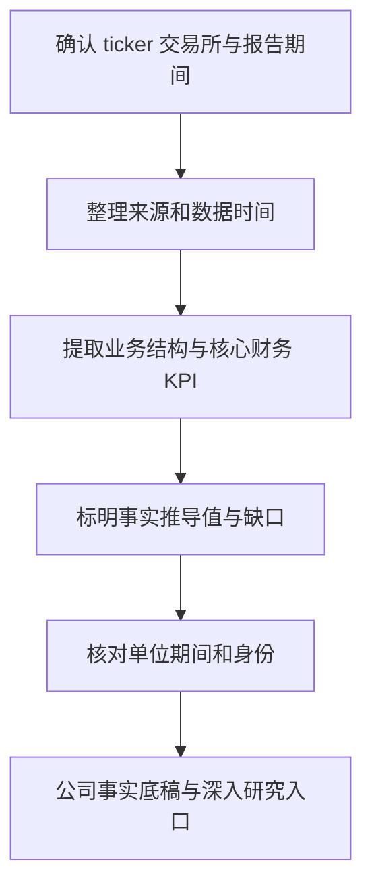

公司底稿建立公共事实基线：后续模型、会议准备和首次覆盖可以共享它。它的职责边界尤其重要：一份简介不能自动升级成评级、目标价和仓位建议。

**实现与边界：** JSON 校验和 Markdown 渲染脚本存在；它们不抓取公司数据，也不替代来源核验。

**源码阅读顺序：** [skills/company-tearsheet/SKILL.md](</Users/marcuschen/Desktop/AI 投研/PEI_OPENAI /skills/company-tearsheet/SKILL.md>) → [skills/company-tearsheet/scripts/validate_tearsheet_json.py](</Users/marcuschen/Desktop/AI 投研/PEI_OPENAI /skills/company-tearsheet/scripts/validate_tearsheet_json.py>) → [skills/company-tearsheet/references/quality-checks.md](</Users/marcuschen/Desktop/AI 投研/PEI_OPENAI /skills/company-tearsheet/references/quality-checks.md>)。

### W03 · 搭建首次覆盖研究（initiating-coverage）

对一家上市公司形成较完整的研究框架，连通观点、财务预测、估值、催化剂和反证。

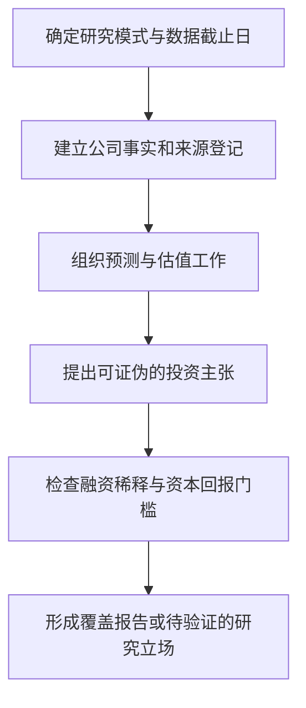

首次覆盖负责把公司、行业、模型和观点组织成完整论证。资本密集型公司的正面结论还需要处理融资、稀释和资金投入后的回报，单看收入规模或收入倍数不够。

**实现与边界：** validate_initiation_json.py 可校验结构；calculate_price_target.py 负责给定假设下的数学。报告完整不代表证据完整，缺估值支撑时应保留初步覆盖或观察名单立场。

**源码阅读顺序：** [skills/initiating-coverage/SKILL.md](</Users/marcuschen/Desktop/AI 投研/PEI_OPENAI /skills/initiating-coverage/SKILL.md>) → [skills/initiating-coverage/scripts/calculate_price_target.py](</Users/marcuschen/Desktop/AI 投研/PEI_OPENAI /skills/initiating-coverage/scripts/calculate_price_target.py>) → [skills/initiating-coverage/references/thesis-framework.md](</Users/marcuschen/Desktop/AI 投研/PEI_OPENAI /skills/initiating-coverage/references/thesis-framework.md>)。

### W04 · 财报前：建立预期门槛（earnings-preview）

公司尚未公布业绩，先明确怎样的结果才真正可能改变股票判断。

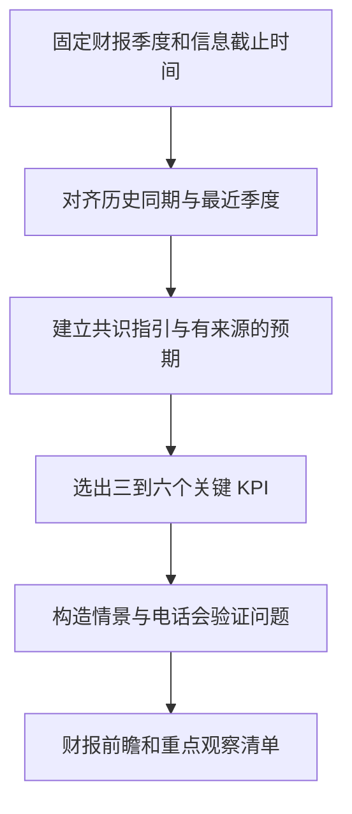

核心是 expectation bar：同一个盈利增速，在市场预期不同的时候可以对应不同股票反应。图中的情景应连到投资分歧与反证，而不是只列收入和 EPS 的三组数字。

**实现与边界：** run_plan.py 使用标准化 CSV，含 build_kpi_dashboard() 和 build_questions()；它是本地生成器。完整脚本包要求的指引和事件文件即使为空，也要有表头。

**源码阅读顺序：** [skills/earnings-preview/SKILL.md](</Users/marcuschen/Desktop/AI 投研/PEI_OPENAI /skills/earnings-preview/SKILL.md>) → [skills/earnings-preview/scripts/run_plan.py](</Users/marcuschen/Desktop/AI 投研/PEI_OPENAI /skills/earnings-preview/scripts/run_plan.py>) → [skills/earnings-preview/references/SCHEMAS.md](</Users/marcuschen/Desktop/AI 投研/PEI_OPENAI /skills/earnings-preview/references/SCHEMAS.md>)。

### W05 · 财报后：判断什么真正变了（earnings-deep-dive）

财报、指引或电话会已经出现，分析它们是否改变原有投资判断。

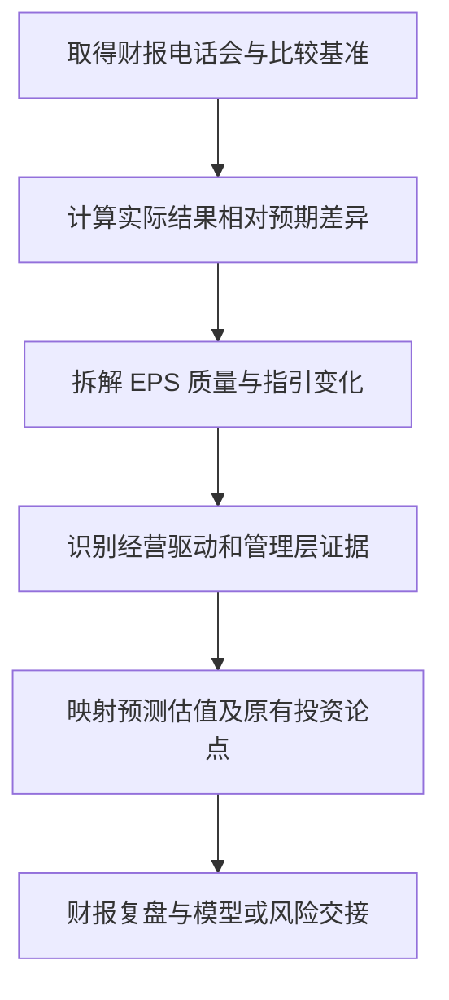

必须区分“超预期的数字”和“可持续的经营改善”。例如盈利变化可能来自税率、股数或非经常项；股价上涨本身也不足以证明原来的经营论点正确。

**实现与边界：** run_plan.py 包含 compute_beat_miss()、compute_guidance()、render_eps_quality_screen()。文件或模型输入路径下可生成更新包；模型写入不安全时应交付驱动更新包。

**源码阅读顺序：** [skills/earnings-deep-dive/SKILL.md](</Users/marcuschen/Desktop/AI 投研/PEI_OPENAI /skills/earnings-deep-dive/SKILL.md>) → [skills/earnings-deep-dive/scripts/run_plan.py](</Users/marcuschen/Desktop/AI 投研/PEI_OPENAI /skills/earnings-deep-dive/scripts/run_plan.py>) → [skills/earnings-deep-dive/scripts/apply_model_updates.py](</Users/marcuschen/Desktop/AI 投研/PEI_OPENAI /skills/earnings-deep-dive/scripts/apply_model_updates.py>)。

### W06 · 把披露转成可建模数据（financials-normalizer）

原始财务披露、KPI 或数据商导出存在命名、期间、单位、符号和口径差异。

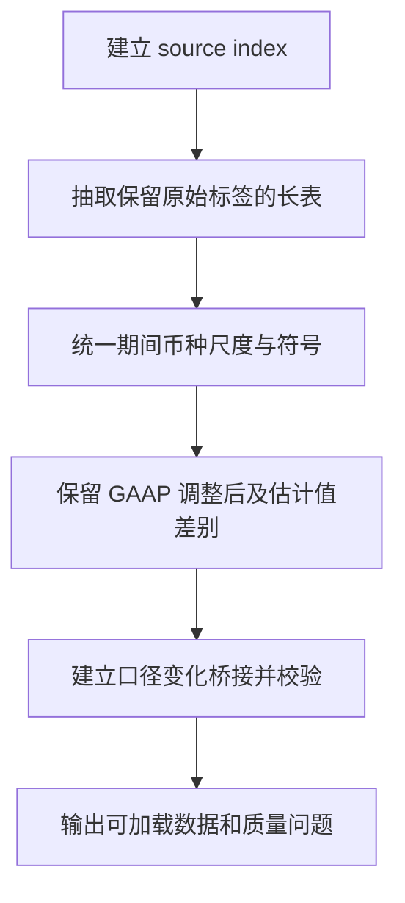

这是语义标准化，不只是把表格排整齐。披露口径变化时，要同时保留新旧口径并解释能否比较，否则同比增速和模型输入都可能失真。

**实现与边界：** normalize_extracted_financials.py 的 normalize_row() 规范化行，build_normalization_issues() 输出问题。该脚本尾部生成长表、来源索引及问题文件；完整宽表模型包还需要按工作流补齐。

**源码阅读顺序：** [skills/financials-normalizer/SKILL.md](</Users/marcuschen/Desktop/AI 投研/PEI_OPENAI /skills/financials-normalizer/SKILL.md>) → [skills/financials-normalizer/scripts/normalize_extracted_financials.py](</Users/marcuschen/Desktop/AI 投研/PEI_OPENAI /skills/financials-normalizer/scripts/normalize_extracted_financials.py>) → [skills/financials-normalizer/scripts/validate_normalized_financials.py](</Users/marcuschen/Desktop/AI 投研/PEI_OPENAI /skills/financials-normalizer/scripts/validate_normalized_financials.py>)。

### W07 · 构建三张报表联动的预测（three-statement-model-builder）

需要从历史财务和经营假设搭建利润表、资产负债表与现金流预测。

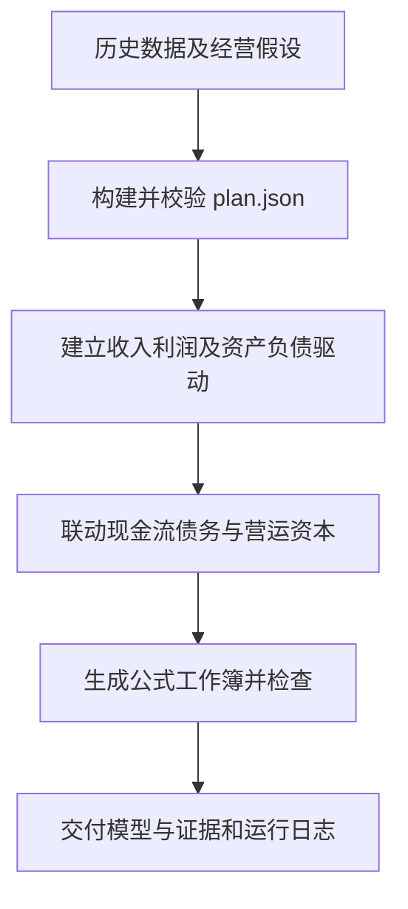

三表回答公司未来怎样赚钱、占用多少资金、现金是否够用。它是估值和风险分析的重要输入，模型必须处理报表联动，而不是分别画三张独立预测表。

**实现与边界：** 公式入口通过 runtime_loader 加载无扩展名 runtime，再调用 build()。实现基于模板填入数据和控制项并检查工作簿；模板与运行日志必须一起核查。

**源码阅读顺序：** [skills/three-statement-model-builder/SKILL.md](</Users/marcuschen/Desktop/AI 投研/PEI_OPENAI /skills/three-statement-model-builder/SKILL.md>) → [skills/three-statement-model-builder/scripts/build_banker_formula_workbook.py](</Users/marcuschen/Desktop/AI 投研/PEI_OPENAI /skills/three-statement-model-builder/scripts/build_banker_formula_workbook.py>) → [skills/three-statement-model-builder/references/banker-formula-workbook-contract.md](</Users/marcuschen/Desktop/AI 投研/PEI_OPENAI /skills/three-statement-model-builder/references/banker-formula-workbook-contract.md>)。

### W08 · 把经营假设转换成内在价值（dcf-model-builder）

需要从现金流、资本成本和终值假设推导企业价值与每股价值。

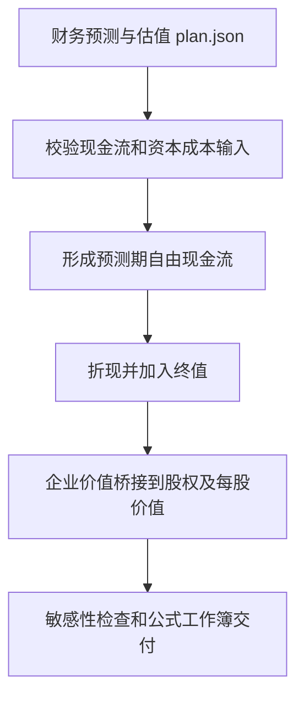

DCF 强迫研究者说明价值由哪些现金流产生，以及结论多大程度依赖折现率和终值。企业价值还需要桥接净债务和股数；缺这些关键输入就不能给出可靠每股价值。

**实现与边界：** 默认公式路径实际存在，runtime 的 build() 调用 materialize_workbook()、inspect_workbook() 并生成 model_citations.json。生成公式及静态检查不等于 Excel 已完整重算。

**源码阅读顺序：** [skills/dcf-model-builder/SKILL.md](</Users/marcuschen/Desktop/AI 投研/PEI_OPENAI /skills/dcf-model-builder/SKILL.md>) → [skills/dcf-model-builder/scripts/build_banker_formula_workbook_runtime](</Users/marcuschen/Desktop/AI 投研/PEI_OPENAI /skills/dcf-model-builder/scripts/build_banker_formula_workbook_runtime>) → [skills/dcf-model-builder/references/banker-formula-workbook-contract.md](</Users/marcuschen/Desktop/AI 投研/PEI_OPENAI /skills/dcf-model-builder/references/banker-formula-workbook-contract.md>)。

### W09 · 用可比公司解释相对估值（comps-valuation）

需要选可比公司、比较交易倍数，并解释目标公司的溢价或折价。

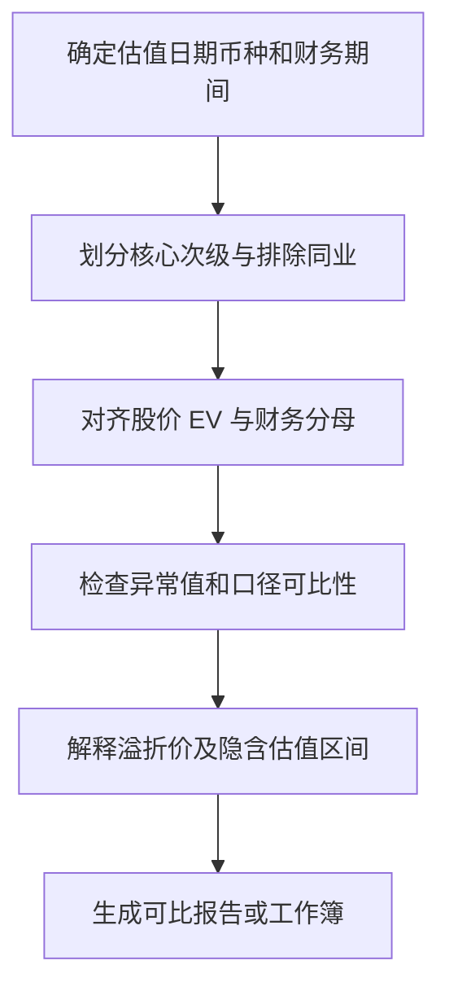

难点在于可比性：增长、利润质量和业务模式不同，较低的倍数未必代表低估。因此先定义同业角色与分母口径，再讨论估值区间。

**实现与边界：** report 和 workbook 两条模式。create_comps_template.py、materialize_screening_comps.py、audit_comps_workbook.py 分别承担模板、填数和审计任务；模板文件不应被称为完成的实数估值。

**源码阅读顺序：** [skills/comps-valuation/SKILL.md](</Users/marcuschen/Desktop/AI 投研/PEI_OPENAI /skills/comps-valuation/SKILL.md>) → [skills/comps-valuation/scripts/materialize_screening_comps.py](</Users/marcuschen/Desktop/AI 投研/PEI_OPENAI /skills/comps-valuation/scripts/materialize_screening_comps.py>) → [skills/comps-valuation/references/peer-selection.md](</Users/marcuschen/Desktop/AI 投研/PEI_OPENAI /skills/comps-valuation/references/peer-selection.md>)。

### W10 · 把新信息安全写入旧模型（equity-model-update）

已有模型，需要把最新实际数或指引转成可审计的预测变更。

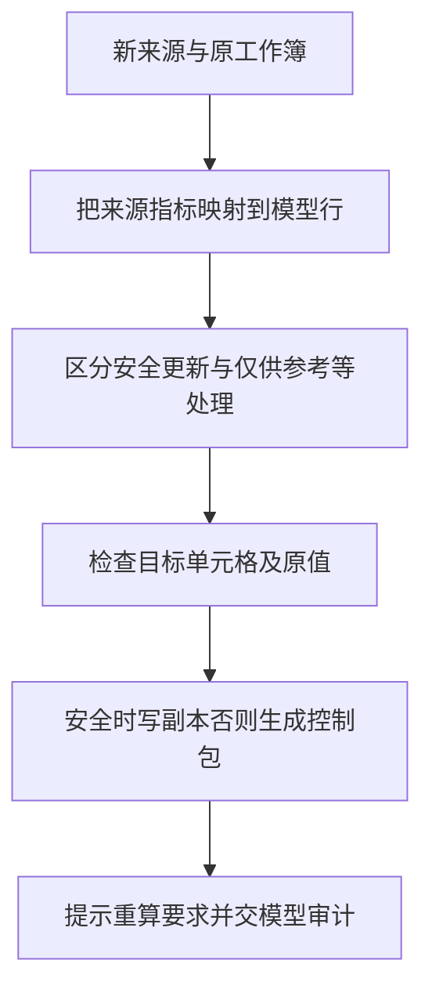

它先判断“这条新信息应该怎么影响模型”，再考虑写入。最新单季实际数不能直接替换年度 DCF 输出；缺模型结构时需要重建说明，不能制造一个看起来更新过的估值。

**实现与边界：** materialize_workbook_update.py 的 inspect_workbook()、apply_workbook_updates()、materialize_workbook_update() 构成关键实现。reference_only 等分支保留信息但不写入模型；原工作簿不变。

**源码阅读顺序：** [skills/equity-model-update/SKILL.md](</Users/marcuschen/Desktop/AI 投研/PEI_OPENAI /skills/equity-model-update/SKILL.md>) → [skills/equity-model-update/scripts/materialize_workbook_update.py](</Users/marcuschen/Desktop/AI 投研/PEI_OPENAI /skills/equity-model-update/scripts/materialize_workbook_update.py>) → [skills/equity-model-update/references/workflow.md](</Users/marcuschen/Desktop/AI 投研/PEI_OPENAI /skills/equity-model-update/references/workflow.md>)。

### W11 · 找出判断在哪些条件下改变（scenario-sensitivity-generator）

已有基本预测或事件条款，想知道哪些变量最重要、到什么阈值需要改变行动。

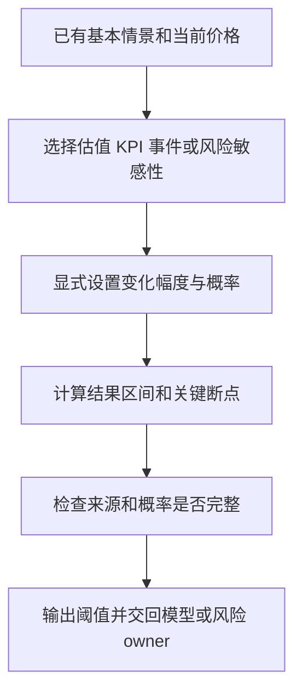

情景分析改变一组互相协调的假设；敏感性分析通常查看单个或少数变量的影响。该模块作为覆盖层，不重复建立整个基础模型。它应解释哪个变量先击穿观点。

**实现与边界：** materialize_public_equity_sensitivities.py 支持八类表。缺基本情景、当前价格或合法概率时，脚本契约限制就绪程度；算术正确但无来源仍只是筛查级。

**源码阅读顺序：** [skills/scenario-sensitivity-generator/SKILL.md](</Users/marcuschen/Desktop/AI 投研/PEI_OPENAI /skills/scenario-sensitivity-generator/SKILL.md>) → [skills/scenario-sensitivity-generator/scripts/materialize_public_equity_sensitivities.py](</Users/marcuschen/Desktop/AI 投研/PEI_OPENAI /skills/scenario-sensitivity-generator/scripts/materialize_public_equity_sensitivities.py>) → [skills/scenario-sensitivity-generator/references/materializer-schema.md](</Users/marcuschen/Desktop/AI 投研/PEI_OPENAI /skills/scenario-sensitivity-generator/references/materializer-schema.md>)。

### W12 · 把未来事件转成研究准备计划（catalyst-calendar）

梳理未来三十、六十、九十天的催化剂及必须提前完成的工作。

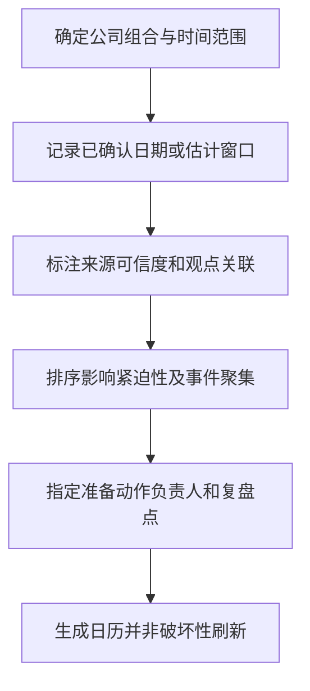

它不只记录“什么时候”，还说明“为什么会改变判断、之前要准备什么”。确认日期、估计窗口和无日期观察项必须区别展示，刷新时保留原事件及变更线索。

**实现与边界：** create_catalyst_calendar_workbook.py 是文件生成器。可导出 ICS，但只把确认的精确日期作为日历事件；生成 ICS 文件不等于已向用户日历写入。

**源码阅读顺序：** [skills/catalyst-calendar/SKILL.md](</Users/marcuschen/Desktop/AI 投研/PEI_OPENAI /skills/catalyst-calendar/SKILL.md>) → [skills/catalyst-calendar/scripts/create_catalyst_calendar_workbook.py](</Users/marcuschen/Desktop/AI 投研/PEI_OPENAI /skills/catalyst-calendar/scripts/create_catalyst_calendar_workbook.py>) → [skills/catalyst-calendar/references/event-scoring-framework.md](</Users/marcuschen/Desktop/AI 投研/PEI_OPENAI /skills/catalyst-calendar/references/event-scoring-framework.md>)。

### W13 · 对特定公司事件做概率与收益分析（event-driven-analyzer）

研究并购、分拆、要约或监管审批等有条件、有时间路径的股票事件。

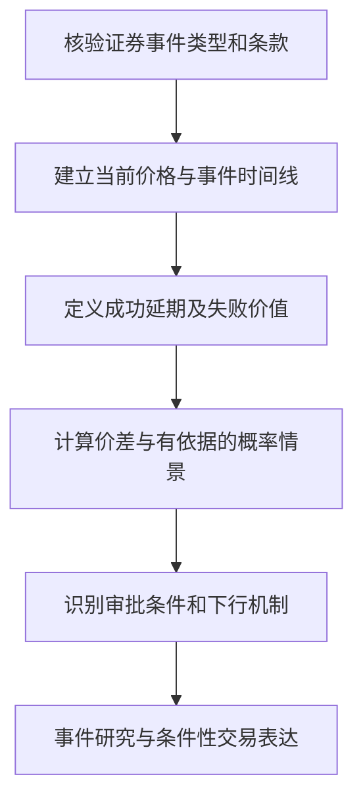

日历只负责时间组织；事件研究还要解释不同结果的价值、发生概率和等待成本。市场隐含概率来自价格与假设，不是对真实成功率的独立证明。

**实现与边界：** event_math.py 有 cash_merger 与 scenario_ev 模式，只执行给定输入下的数学；它不会核验交易条款或自行评估监管概率。概率和不为一默认失败。

**源码阅读顺序：** [skills/event-driven-analyzer/SKILL.md](</Users/marcuschen/Desktop/AI 投研/PEI_OPENAI /skills/event-driven-analyzer/SKILL.md>) → [skills/event-driven-analyzer/scripts/event_math.py](</Users/marcuschen/Desktop/AI 投研/PEI_OPENAI /skills/event-driven-analyzer/scripts/event_math.py>)。

### W14 · 把宏观变化传导到上市公司（economic-impact-report）

政策、商品、汇率或地缘事件出现，需要判断它通过什么机制影响具体股票。

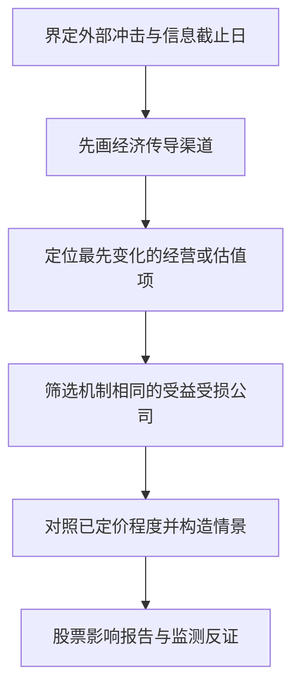

它要求每条宏观链条落到公司收入、成本、盈利、估值或组合风险。相同主题下的公司如果受影响机制不同，应分开分析，不能只贴同一个受益标签。

**实现与边界：** check_economic_impact_report.py 是报告检查辅助；因果链和证据解释主要由 Agent 按工作流完成。该模块边界是股票影响，不是完整宏观或固定收益研究平台。

**源码阅读顺序：** [skills/economic-impact-report/SKILL.md](</Users/marcuschen/Desktop/AI 投研/PEI_OPENAI /skills/economic-impact-report/SKILL.md>) → [skills/economic-impact-report/scripts/check_economic_impact_report.py](</Users/marcuschen/Desktop/AI 投研/PEI_OPENAI /skills/economic-impact-report/scripts/check_economic_impact_report.py>) → [skills/economic-impact-report/references/workflow.md](</Users/marcuschen/Desktop/AI 投研/PEI_OPENAI /skills/economic-impact-report/references/workflow.md>)。

### W15 · 把研究观点构造成交易提案（long-short-pitch）

已经有候选观点，想说明为什么值得做多、做空或采用配对表达。

```mermaid
flowchart TD
 N0["明确相对市场的认知分歧"]
 N1["选择股票方向或配对表达"]
 N2["验证价格估值与催化剂路径"]
 N3["计算有来源支撑的收益风险情景"]
 N4["检查借券成本流动性及实施条件"]
 N5["提出交易立场与加减仓退出条件"]
 N0 --> N1
 N1 --> N2
 N2 --> N3
 N3 --> N4
 N4 --> N5
```

好的 pitch 要说明预期差如何兑现为回报、为什么是现在、亏损路径是什么。做空还需要借券、挤空和持有成本；公司判断正确，也可能无法形成合适交易。

**实现与边界：** materialize_trade_scenarios.py 计算给定情景的期望值。投资判断和实施条件仍归主工作流，缺关键条件时保留观察或待验证立场。

**源码阅读顺序：** [skills/long-short-pitch/SKILL.md](</Users/marcuschen/Desktop/AI 投研/PEI_OPENAI /skills/long-short-pitch/SKILL.md>) → [skills/long-short-pitch/scripts/materialize_trade_scenarios.py](</Users/marcuschen/Desktop/AI 投研/PEI_OPENAI /skills/long-short-pitch/scripts/materialize_trade_scenarios.py>) → [skills/long-short-pitch/references/output-contract.md](</Users/marcuschen/Desktop/AI 投研/PEI_OPENAI /skills/long-short-pitch/references/output-contract.md>)。

### W16 · 决定持有多少与如何对冲（portfolio-risk-management）

有现有或拟议仓位，需要在收益主张和实际风险约束间作权衡。

```mermaid
flowchart TD
 N0["确定仓位目标与要保留的暴露"]
 N1["区分情景损失预算和绝对损失上限"]
 N2["建立下行情景与退出能力"]
 N3["选择仓位对冲或整合模式"]
 N4["比较约束成本及对冲失效风险"]
 N5["输出条件性规模和监控动作"]
 N0 --> N1
 N1 --> N2
 N2 --> N3
 N3 --> N4
 N4 --> N5
```

仓位通常受多个约束共同限制，应识别最紧的可信约束。对冲也不是把风险全部消掉，而是区分希望保留的公司风险和不希望承担的市场或因子风险。

**实现与边界：** position_sizing_calculator.py 与 score_hedge_candidates.py 提供计算支持，不连接真实交易或组合风控系统。缺现价、借券、流动性等输入时不能给出已可实施的建仓表述。

**源码阅读顺序：** [skills/portfolio-risk-management/SKILL.md](</Users/marcuschen/Desktop/AI 投研/PEI_OPENAI /skills/portfolio-risk-management/SKILL.md>) → [skills/portfolio-risk-management/scripts/position_sizing_calculator.py](</Users/marcuschen/Desktop/AI 投研/PEI_OPENAI /skills/portfolio-risk-management/scripts/position_sizing_calculator.py>) → [skills/portfolio-risk-management/references/sizing-framework.md](</Users/marcuschen/Desktop/AI 投研/PEI_OPENAI /skills/portfolio-risk-management/references/sizing-framework.md>)。

### W17 · 保留原观点并持续检验（thesis-tracker）

已有投资论点或跟踪表，需要用新证据更新状态和下一步动作。

```mermaid
flowchart TD
 N0["保存原始投资依据"]
 N1["拆成可证伪支柱 KPI 与阈值"]
 N2["追加支持和反对证据"]
 N3["更新预测估值及预期比较"]
 N4["分别判断公司观点与股票吸引力"]
 N5["追加决策记录和下一次复核点"]
 N0 --> N1
 N1 --> N2
 N2 --> N3
 N3 --> N4
 N4 --> N5
```

它防止事后改写原始论点。公司经营改善、股票性价比下降可以同时成立；股价涨跌不能直接替代基本面证据。新增阈值还要区分分析师草案、继承规则和已批准规则。

**实现与边界：** materialize_thesis_tracker.py 生成新的 CSV 支持包及可选 XLSX，不直接原地修改旧 tracker。长期跟踪契约主要体现在追加证据、明确责任和复核节奏。

**源码阅读顺序：** [skills/thesis-tracker/SKILL.md](</Users/marcuschen/Desktop/AI 投研/PEI_OPENAI /skills/thesis-tracker/SKILL.md>) → [skills/thesis-tracker/scripts/materialize_thesis_tracker.py](</Users/marcuschen/Desktop/AI 投研/PEI_OPENAI /skills/thesis-tracker/scripts/materialize_thesis_tracker.py>) → [skills/thesis-tracker/references/workflow-core.md](</Users/marcuschen/Desktop/AI 投研/PEI_OPENAI /skills/thesis-tracker/references/workflow-core.md>)。

### W18 · 把研究缺口变成有效问题（meeting-prep）

要准备管理层、专家、PM 或内部研究讨论，明确哪些回答会改变判断。

```mermaid
flowchart TD
 N0["确认会议目的和参与者"]
 N1["读取已有研究及关键缺口"]
 N2["挑选能改变判断的问题"]
 N3["设计听什么和如何追问"]
 N4["整理证据请求及会前简报"]
 N5["会后记录新事实负责人和截止日"]
 N0 --> N1
 N1 --> N2
 N2 --> N3
 N3 --> N4
 N4 --> N5
```

会议准备应从研究分歧出发，把问题与模型或观点连接起来。对管理层的定性回答，应准备可以继续追问的量化证据请求，而不是重复公司背景介绍。

**实现与边界：** 当前 skill 主要是指令和引用规范，本次未见该目录的 Python 执行脚本。生成会议简报或后续邮件草稿，不代表已经安排会议或发送信息。

**源码阅读顺序：** [skills/meeting-prep/SKILL.md](</Users/marcuschen/Desktop/AI 投研/PEI_OPENAI /skills/meeting-prep/SKILL.md>) → [skills/meeting-prep/references/meeting-type-playbooks.md](</Users/marcuschen/Desktop/AI 投研/PEI_OPENAI /skills/meeting-prep/references/meeting-type-playbooks.md>)。

### W19 · 把已完成的分析组织成决策文件（memo-builder）

研究结论、交易构造或财报分析需要转成 IC、PM 或正式研究备忘录。

```mermaid
flowchart TD
 N0["确认受众和需要做出的决策"]
 N1["汇入已有研究模型与证据"]
 N2["组织观点成立条件与估值论证"]
 N3["补齐反证催化剂和行动纪律"]
 N4["检查数字来源及结论一致性"]
 N5["生成正式备忘录并交报告 QC"]
 N0 --> N1
 N1 --> N2
 N2 --> N3
 N3 --> N4
 N4 --> N5
```

Memo 负责论证组织和正式表达；当“应该做什么交易”尚未解决时，先交 long-short-pitch。把尚未完成的分析写成流畅文章不会自动提升其可信度。

**实现与边界：** build_memo_package.py 是包装助手。源码说明它会生成多种格式；本次用户明确要 Markdown，导学不调用该助手，也不创建 Word 文件。

**源码阅读顺序：** [skills/memo-builder/SKILL.md](</Users/marcuschen/Desktop/AI 投研/PEI_OPENAI /skills/memo-builder/SKILL.md>) → [skills/memo-builder/scripts/build_memo_package.py](</Users/marcuschen/Desktop/AI 投研/PEI_OPENAI /skills/memo-builder/scripts/build_memo_package.py>) → [skills/memo-builder/references/quality-workflow.md](</Users/marcuschen/Desktop/AI 投研/PEI_OPENAI /skills/memo-builder/references/quality-workflow.md>)。

### W20 · 检查模型能否支撑指定判断（model-audit-tieout）

已有模型，需要审查公式、来源、预测假设与输出是否一致。

```mermaid
flowchart TD
 N0["确认模型用途和本次审计范围"]
 N1["扫描工作表公式与链接"]
 N2["从关键输出追溯假设和来源"]
 N3["检查口径桥接及情景合理性"]
 N4["按严重程度记录问题与决策影响"]
 N5["给出可使用范围和修复次序"]
 N0 --> N1
 N1 --> N2
 N2 --> N3
 N3 --> N4
 N4 --> N5
```

审计判断的是模型能不能支持用户指定的用途。没有 DCF 页的三表模型不一定有错，要先确认估值是否由外部模块负责；审计者临时加入的压力假设也不等于已经修好了预测。

**实现与边界：** audit_workbook.py 是起点，不能替代所有来源核对和人工审查。公式存在、缓存可读、重新计算成功是不同证据，需要分别说明。

**源码阅读顺序：** [skills/model-audit-tieout/SKILL.md](</Users/marcuschen/Desktop/AI 投研/PEI_OPENAI /skills/model-audit-tieout/SKILL.md>) → [skills/model-audit-tieout/scripts/audit_workbook.py](</Users/marcuschen/Desktop/AI 投研/PEI_OPENAI /skills/model-audit-tieout/scripts/audit_workbook.py>) → [skills/model-audit-tieout/references/audit-playbook.md](</Users/marcuschen/Desktop/AI 投研/PEI_OPENAI /skills/model-audit-tieout/references/audit-playbook.md>)。

### W21 · 交付前核对报告和模型的一致性（deck-report-qc）

报告、投资备忘录或演示文稿准备交给 PM 或客户，需要最后一次质量检查。

```mermaid
flowchart TD
 N0["指定控制文档与支持材料"]
 N1["抽取文本数字和来源地图"]
 N2["核对重复数字单位及论证"]
 N3["把报告关键数追溯到模型与证据"]
 N4["渲染检查重要页面和图表"]
 N5["输出问题清单及可流转状态"]
 N0 --> N1
 N1 --> N2
 N2 --> N3
 N3 --> N4
 N4 --> N5
```

该关口面向最终读者看到的成品：表格、标题、图表和正文必须说同一件事。可视化问题不能只靠文本抽取判定；高严重度可见内容问题要回到对应页面验证。

**实现与边界：** inspect_deck_report.py 和 qc_analysis.py 支持初筛。最终报告 QC 与模型审计互补；文本扫描通过不足以证明图表正确、来源充分或研究结论成立。

**源码阅读顺序：** [skills/deck-report-qc/SKILL.md](</Users/marcuschen/Desktop/AI 投研/PEI_OPENAI /skills/deck-report-qc/SKILL.md>) → [skills/deck-report-qc/scripts/inspect_deck_report.py](</Users/marcuschen/Desktop/AI 投研/PEI_OPENAI /skills/deck-report-qc/scripts/inspect_deck_report.py>) → [skills/deck-report-qc/references/qc-playbook.md](</Users/marcuschen/Desktop/AI 投研/PEI_OPENAI /skills/deck-report-qc/references/qc-playbook.md>)。

<a id="support"></a>

## 四、内部支持层：七种能力分别做什么

### 来源与证据控制（financial-source-of-truth）

```mermaid
flowchart LR
 S0["待使用的事实或数字"]
 S1["识别来源类型时间期间与位置"]
 S2["检查冲突过期和证据缺口"]
 S3["区分事实管理层表述推导与假设"]
 S4["交回可追溯来源及结论限制"]
 S0 --> S1
 S1 --> S2
 S2 --> S3
 S3 --> S4
```

它管理证据层级和可信范围，不是一个保证正确的中央数据库。只要来源冲突会改变估值或行动，就应该把影响交回主工作流。 入口：[skills/public-equity-investing/internal-support/financial-source-of-truth/INTERNAL.md](</Users/marcuschen/Desktop/AI 投研/PEI_OPENAI /skills/public-equity-investing/internal-support/financial-source-of-truth/INTERNAL.md>)。

### 表格清洗（excel-data-cleaner）

```mermaid
flowchart LR
 S0["保留原工作簿或原始表"]
 S1["识别异常表头类型重复和日期"]
 S2["整理结构并保留标识与时间"]
 S3["记录清洗变更与未解决问题"]
 S4["交回可处理的表和质量说明"]
 S0 --> S1
 S1 --> S2
 S2 --> S3
 S3 --> S4
```

清洗让数据可读、可操作；财务标准化进一步解决会计和经济含义。格式整齐并不证明一个 KPI 与另一期可比。 入口：[skills/public-equity-investing/internal-support/excel-data-cleaner/INTERNAL.md](</Users/marcuschen/Desktop/AI 投研/PEI_OPENAI /skills/public-equity-investing/internal-support/excel-data-cleaner/INTERNAL.md>)。

### 行业分析口径（sector-context-overlay）

```mermaid
flowchart LR
 S0["主工作流与公司商业模式"]
 S1["识别一个匹配的行业主视角"]
 S2["按需加载行业 KPI 和建模规则"]
 S3["检查跨行业误用及红旗"]
 S4["把行业建议交回原 owner"]
 S0 --> S1
 S1 --> S2
 S2 --> S3
 S3 --> S4
```

已列出的视角包括银行、生物医药、消费互联网、交易所、保险、油气勘探生产、REITs 和 SaaS。它以渐进加载减少无关规则，同时保持财报、估值或风险 owner 的职责。 入口：[skills/public-equity-investing/internal-support/sector-context-overlay/INTERNAL.md](</Users/marcuschen/Desktop/AI 投研/PEI_OPENAI /skills/public-equity-investing/internal-support/sector-context-overlay/INTERNAL.md>)。

### 标准化看板渲染（dashboard-builder）

```mermaid
flowchart LR
 S0["主工作流产出的结构化分析"]
 S1["映射 typed dashboard payload"]
 S2["校验字段来源与模块要求"]
 S3["用共享模板 CSS 和 JS 渲染"]
 S4["检查展示与证据缺口后交付"]
 S0 --> S1
 S1 --> S2
 S2 --> S3
 S3 --> S4
```

只有选定标准化看板路径时使用。自由布局的 HTML 报告直接遵循 HTML 规范，不必全部进入统一看板。渲染器负责展示和结构校验，不重新作投资判断。 入口：[skills/public-equity-investing/internal-support/dashboard-builder/INTERNAL.md](</Users/marcuschen/Desktop/AI 投研/PEI_OPENAI /skills/public-equity-investing/internal-support/dashboard-builder/INTERNAL.md>)。

### 机构风格适配（style-guide-adapter）

```mermaid
flowchart LR
 S0["明确用户要求和参考风格"]
 S1["提取排版语言与格式规范"]
 S2["识别冲突及适用的产物类型"]
 S3["按安全编辑能力应用风格"]
 S4["核对事实公式引用与结论未变"]
 S0 --> S1
 S1 --> S2
 S2 --> S3
 S3 --> S4
```

它将风格与内容判断分开，避免为了统一版式误改数字或隐藏证据限制。该能力并不意味着已经存在支持任何文件格式的通用编辑器。 入口：[skills/public-equity-investing/internal-support/style-guide-adapter/INTERNAL.md](</Users/marcuschen/Desktop/AI 投研/PEI_OPENAI /skills/public-equity-investing/internal-support/style-guide-adapter/INTERNAL.md>)。

### Daloopa 来源调用指导（daloopa-provider-guide）

```mermaid
flowchart LR
 S0["主工作流需要财务或 KPI 数据"]
 S1["确认本次运行有可调用的来源路径"]
 S2["加载匹配的提供商指导"]
 S3["限定公司期间和所需字段"]
 S4["返回带提供商引用的数据"]
 S0 --> S1
 S1 --> S2
 S2 --> S3
 S3 --> S4
```

这是提供商使用规范。它不能因为目录里存在，就证明账号有权限、插件已连接或请求已成功；价格、市场预期及其他来源仍需分开标注。 入口：[skills/public-equity-investing/internal-support/daloopa-provider-guide/INTERNAL.md](</Users/marcuschen/Desktop/AI 投研/PEI_OPENAI /skills/public-equity-investing/internal-support/daloopa-provider-guide/INTERNAL.md>)。

### Quartr 文档与事件调用指导（quartr-provider-guide）

```mermaid
flowchart LR
 S0["主工作流需要披露电话会或事件"]
 S1["确认本次运行有可调用的来源路径"]
 S2["加载匹配的提供商指导"]
 S3["限定文档事件或财务字段"]
 S4["返回原始出处和期间信息"]
 S0 --> S1
 S1 --> S2
 S2 --> S3
 S3 --> S4
```

其适用范围包括公司披露、演示文稿、电话会、事件及标准化实际财务等。与上一个模块一样，数据商路径必须在真实运行中验证，不能由静态配置推定可用。 入口：[skills/public-equity-investing/internal-support/quartr-provider-guide/INTERNAL.md](</Users/marcuschen/Desktop/AI 投研/PEI_OPENAI /skills/public-equity-investing/internal-support/quartr-provider-guide/INTERNAL.md>)。

提供商两图依据已读取的 router 运行契约、来源解析文档和内部注册表整理；本次没有选定真实提供商路径，也未调用服务或加载其延迟使用的专门操作指引。其余五个模块已检查本地 `INTERNAL.md`。

<a id="mechanics"></a>

## 五、把容易混淆的部分进一步拆开

### 图 35：资料、数据、判断和行动分成四层

```mermaid
flowchart TD
 A["原始披露：公司说了什么"] --> B["标准化数据：期间单位定义可比较"]
 B --> C["模型：在明确假设下推导结果"]
 C --> D["研究判断：对照市场预期与反证"]
 D --> E["风险方案：在约束内形成条件性动作"]
 A -.-> S["所有关键节点保留来源与时间"]
 B -.-> S
 C -.-> S
 D -.-> S
 S -.-> Q["审计与复核"]
```

对 UniPat 的设计借鉴是：不要把“引用存在”“计算正确”“结论成立”“可以执行”合成一个通过标记。它们各自需要证据。管理层说增长会加速属于表述，模型假设增长加速属于假设，对股票看多属于判断；三者不能共用一种来源标签。

### 图 36：模型更新的关键安全分支（依据代码与工作流）

```mermaid
flowchart TD
 A["新指标与待更新模型行"] --> B{"mapping_treatment"}
 B -->|safe_update| C{"目标输入安全且来源充分？"}
 B -->|reference_only| D["只保留为参考信息"]
 B -->|assumption_required| E["等待明确投资假设"]
 B -->|missing_model_architecture| F["列出缺失模型结构"]
 B -->|rebuild_required| G["交给建模工作流重建"]
 C -->|是| H["更新副本中的非公式输入"]
 C -->|否| I["生成控制包和问题说明"]
 H --> J["披露重算需求并做模型审计"]
 D --> I
 E --> I
 F --> I
 G --> I
```

这组分支值得优先读源码。它把事实到模型的映射处理写成了明确控制逻辑，减少 Agent 看到新数字就修改旧模型的风险。阅读 `apply_workbook_updates()` 时，应分别检查未找到目标、目标是公式、原值不符、来源过期等情形是否进入安全退路。

### 图 37：三表与 DCF 的代码入口如何加载实现

```mermaid
flowchart LR
 A["build_banker_formula_workbook.py"] --> B["load_runtime_module"]
 B --> C["加载同目录无扩展名 runtime"]
 C --> D["runtime.main"]
 D --> E["build：校验 plan 并准备模板更新"]
 E --> F["materialize_workbook"]
 F --> G["inspect_workbook 与 citations 校验"]
 G --> H["工作簿／日志／manifest／引用映射"]
```

这张是已核对的代码调用链。两种模型共享“薄入口 + 运行时加载 + 模板生成 + 检查”的形式，但业务模型不同：三表关心经营预测与现金联动，DCF 关心折现与价值桥接。阅读时只搜 `.py` 会漏掉真正实现文件 `build_banker_formula_workbook_runtime`。当前本地模板是否存在已纳入文末校验，但这次没有执行模型构建或 Excel 重算。

### 图 38：看板生成的代码关口

```mermaid
flowchart TD
 A["render_dashboard：默认 validate 为 true"] --> B["validate_payload：默认 production profile"]
 B --> C{"有 hard_failures？"}
 C -->|有| D["抛出 ValueError，停止本次渲染"]
 C -->|无| E["读取 CSS 模板与 JS"]
 E --> F["解析来源并渲染各模块"]
 F --> G["返回完整 HTML 字符串"]
 G --> H["由调用方保存并进行视觉检查"]
```

代码证据：[shared/dashboard/renderer.py](</Users/marcuschen/Desktop/AI 投研/PEI_OPENAI /shared/dashboard/renderer.py>) 的 `render_dashboard()` 与 [shared/dashboard/qa.py](</Users/marcuschen/Desktop/AI 投研/PEI_OPENAI /shared/dashboard/qa.py>) 的 `validate_payload()`。这里的生产校验可以拒绝结构和来源问题，但无法单独证明所有经济解释正确；函数参数也允许调用者改变校验行为，因此评测还需要覆盖真实调用路径。

### 图 39：就绪程度是一组关口，不是一次生成成功

```mermaid
flowchart TD
 A["有了产物"] --> B{"数据和假设是否充分？"}
 B -->|不足但可分析| C["筛查级：明确缺口与升级条件"]
 B -->|足够| D{"计算与模型检查通过？"}
 D -->|否| E["不适合决策：先修复"]
 D -->|是| F["可进入资深复核"]
 F --> G{"对应决策与实施条件齐备？"}
 G -->|否| H["给条件性研究结论"]
 G -->|是| I["在限定用途内支持人类决策"]
 A --> J["流转前另做报告 QC"]
```

这是对多个契约的教学归纳，不是当前代码里统一实现的状态机。模型常用 `screen-grade`、`senior-review-ready`、`not-decision-ready`，支持层又使用下划线枚举及其他状态。若未来把它接成自动系统，需要显式映射不同词表，避免“来源足够”被误读成“可以下单”。

### 图 40：如何评测一个 AI 投研工作流

```mermaid
flowchart LR
 A["给定请求与固定来源包"] --> B["路由是否选对 owner"]
 B --> C["关键来源与期间是否正确"]
 C --> D["计算及模型修改是否安全"]
 D --> E["观点是否解释预期差与反证"]
 E --> F["主产物是否可读且可追溯"]
 F --> G["缺口是否限制了结论和动作"]
 G --> H["形成逐层评测证据"]
```

对 UniPat 的应用分析可以把这个包当作“任务与质量契约的候选库”。评测至少分清路由、来源、计算、投研论证和交付五个层次。已有测试既包括搜索关键术语的静态契约测试，也包括构造 XLSX 后调用模型更新脚本的行为测试；前者证明规则写进了文件，后者只证明覆盖案例的程序行为。两者均不能单独证明真实公司研究有效。参考：[tests/test_pm_judgment_language.py](</Users/marcuschen/Desktop/AI 投研/PEI_OPENAI /tests/test_pm_judgment_language.py>)、[tests/test_equity_model_update_workbook.py](</Users/marcuschen/Desktop/AI 投研/PEI_OPENAI /tests/test_equity_model_update_workbook.py>)、[tests/test_portfolio_risk_management_sizing_logic.py](</Users/marcuschen/Desktop/AI 投研/PEI_OPENAI /tests/test_portfolio_risk_management_sizing_logic.py>)。

<a id="boundaries"></a>

## 六、设计取舍与当前目录的边界

| 机制                           | 它解决的问题                 | 需要进一步验证的风险                       |
| ------------------------------ | ---------------------------- | ------------------------------------------ |
| 一个主工作流负责结果           | 明确判断责任，减少重复研究   | 路由边界是否在真实自然语言请求中稳定       |
| 按需加载 references 与行业视角 | 控制上下文体积，避免无关规则 | Agent 是否在关键时刻加载了正确文件         |
| 来源类型、时间与出处贯穿交接   | 防止数字失去语境             | 引用存在是否足够精确地支持该句结论         |
| Agent 判断与确定性脚本分工     | 让可计算部分复现             | 脚本输入假设是否有证据，输出是否被正确解释 |
| 副本更新与控制包退路           | 保护模型结构和原始文件       | 工作簿特性、重算与复杂公式是否完整保留     |
| 主产物与审计附件分开           | 兼顾可读性与可追溯性         | 关键限制是否只留在附件，读者看不到         |
| 公司观点与股票判断分开         | 避免把好公司直接当成好投资   | 当前价格、预期和组合约束是否真正进入判断   |

**本地快照有几处不一致。** 第一，README 和运行契约引用 `.app.json` 与 `.codex-plugin/plugin.json`，当前目录未发现这两个文件，因此只能确认这里保存了技能与相关代码，不能确认它是一份注册元数据完整的可安装包；也可能是复制时未包含隐藏文件，本次没有验证复制来源。第二，router 列出 `test-public-equity-investing-workflows`，当前没有对应的 `SKILL.md`，因此它没有被算成第 22 个投研工作流。第三，README 写测试和历史评测资产位于外部 harness，但本地仍有 `tests/`；应把当前可见测试与外部评测环境区分开。

**需要统一的契约也值得记下来。** 公司底稿在路由表中默认指向 HTML，而具体 skill 对快速底稿允许聊天输出；就绪状态在不同层有不同枚举。跨工作流运行契约还提到当前工具接口并未提供的 `autoResolutionMs`。这些是版本同步与运行适配的检查点，不能假设所有说明在任意宿主里都可以原样执行。本文依据用户明确选择使用 Markdown，不触发研究产物格式的额外询问。

**能力边界必须保留。** 本次没有检查可用行情权限、连接器、注册状态或外部评测 harness，也没有对某一家上市公司给出投资建议。当前图谱展示的是可读源码中的设计与实现落点；真实可用性仍需一次带来源包、模型和输出证据的端到端运行来证明。

<a id="learning"></a>

## 七、带着你读的顺序：六次小课

| 次序 | 学习任务           | 先读什么                                              | 读完应能解释                                           |
| ---- | ------------------ | ----------------------------------------------------- | ------------------------------------------------------ |
| 1    | 建立插件全貌       | 本文图 1—6、README、总路由与 routing map              | 为什么需要主工作流，支持模块为什么不能直接决定投资结论 |
| 2    | 走通一次财报周期   | W04 前瞻 → W05 复盘 → W10 更新模型                    | 前瞻设定了什么基准，复盘如何把新证据转成更新           |
| 3    | 理解模型与估值     | W06 标准化 → W07 三表 → W08 DCF → W09 可比 → W11 情景 | 数据、预测、估值、敏感性各自解决什么问题               |
| 4    | 从研究进入投资行动 | W15 pitch → W16 风险 → W17 tracker                    | 观点正确为什么仍可能不适合建仓，哪些条件会改变行动     |
| 5    | 补上事件与宏观路线 | W12 日历 → W13 事件 → W14 经济影响                    | 时间组织、事件收益和经济传导为什么要分别负责           |
| 6    | 检查交付与工程质量 | W18 会议 → W19 memo → W20 审计 → W21 QC、图 36—40     | 哪些检查有实际代码，哪些还需要 Agent 或人类复核        |

W01 候选筛选、W02 公司底稿和 W03 首次覆盖适合在需要从零研究一家公司时串起来复习；它们与第 2 课的财报链路形成两种不同入口。每一课都可以拿一份固定的小样本输入，记录“进来什么—中间形成什么—出去什么—何时必须降级”。遇到不懂的文件或金融概念，可以继续沿对应图中的节点展开；不必先读完全部实现。

建议从第 1 课的一个具体例子开始：用户说“这家公司刚发完财报，帮我判断原来的看多观点有没有变化”。第一步应由 `earnings-deep-dive` 主导，因为第一个实质判断是本季业绩如何影响原观点；只有确认模型和仓位工作也在任务范围内，再接模型更新与风险管理。这个例子把入口路由、证据、计算和最终责任连在了一起。

<a id="snapshot"></a>

## 八、源码快照与覆盖核验

| 文件                                                         | SHA-256 前 16 位   |
| ------------------------------------------------------------ | ------------------ |
| [README.md](</Users/marcuschen/Desktop/AI 投研/PEI_OPENAI /README.md>) | `2b77d39ae036dc47` |
| [shared/plugin-routing-map.json](</Users/marcuschen/Desktop/AI 投研/PEI_OPENAI /shared/plugin-routing-map.json>) | `86902846e84a916f` |
| [shared/support-layer-routing-contract.md](</Users/marcuschen/Desktop/AI 投研/PEI_OPENAI /shared/support-layer-routing-contract.md>) | `bf485e99d54b2594` |
| [skills/public-equity-investing/SKILL.md](</Users/marcuschen/Desktop/AI 投研/PEI_OPENAI /skills/public-equity-investing/SKILL.md>) | `63a63b89e5a65de1` |
| [skills/equity-model-update/scripts/materialize_workbook_update.py](</Users/marcuschen/Desktop/AI 投研/PEI_OPENAI /skills/equity-model-update/scripts/materialize_workbook_update.py>) | `acd31c5fdce6dcf7` |
| [skills/dcf-model-builder/scripts/build_banker_formula_workbook_runtime](</Users/marcuschen/Desktop/AI 投研/PEI_OPENAI /skills/dcf-model-builder/scripts/build_banker_formula_workbook_runtime>) | `edaa497397bff760` |
| [shared/dashboard/renderer.py](</Users/marcuschen/Desktop/AI 投研/PEI_OPENAI /shared/dashboard/renderer.py>) | `1cc47e45f534f2f3` |

快照摘要用于定位本次阅读的文件内容，不能代替 Git 提交号。全工作流覆盖核验与链接检查结果保存在同目录的 `guide_validation.json`；它记录文档检查，不记录投资研究测试通过。